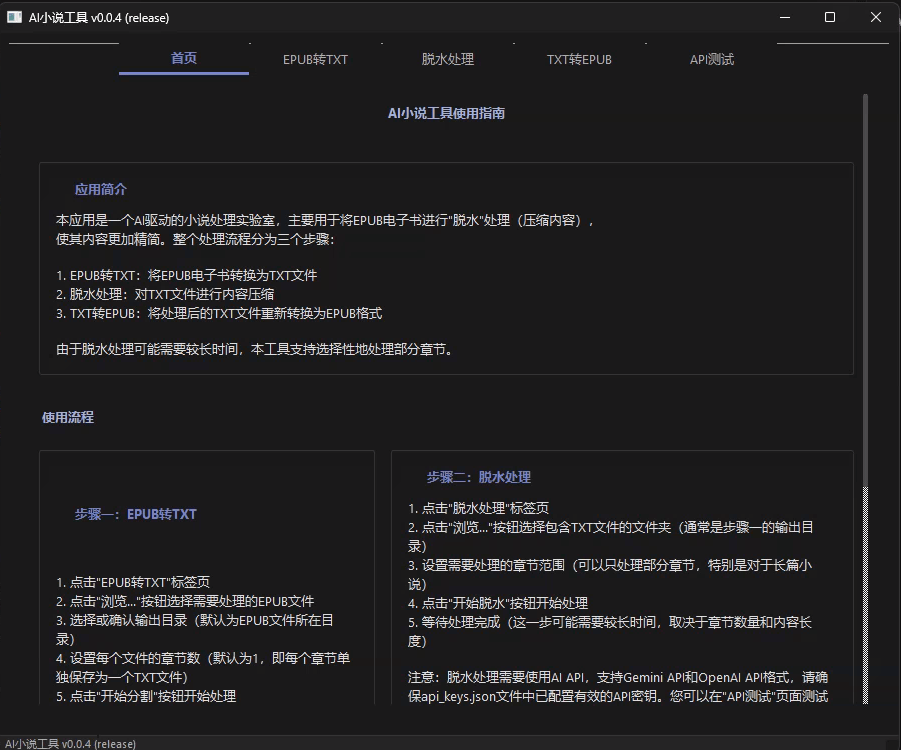

# AI小说工具 (AINovelLab)



这是一个用Python开发的小说处理工具套件，集成了多种AI服务，提供智能化的小说内容处理功能。

## 版本信息

- 当前版本：v0.0.1 (release)
- 构建日期：2024-04-07
- 支持平台：Windows/macOS/Linux

## 核心功能

1. **EPUB分割器**
   - 将EPUB电子书分割为单章TXT文件
   - 支持自定义分割规则
   - 批量处理多个文件

   

2. **小说脱水工具**
   - 使用AI自动将小说内容缩减至原文的30%-50%
   - 多API服务并行处理
   - 智能API切换，提高效率
   - 支持批量处理

   

3. **TXT合并转EPUB**
   - 将TXT文件合并为EPUB电子书
   - 自动提取元数据
   - 生成目录和章节结构

   

## API支持

支持Gemini 和任何符合openai-api 规范的api，如DeepSeek 等


## 快速开始

### 方法一：使用预编译的可执行文件

1. 下载最新版本的AINovelLab.zip
2. 解压至任意位置
3. 运行AINovelLab.exe

### 方法二：从源码运行

1. 克隆或下载本仓库
2. 安装依赖：`pip install -r requirements.txt`
3. 运行程序：`python run.py`

## 基本使用

### 脱水处理流程

1. **EPUB转TXT**：使用EPUB分割器将电子书转换为TXT文件
2. **脱水处理**：对TXT文件进行AI内容压缩
3. **TXT转EPUB**：将处理后的TXT文件重新转换为EPUB格式


### API配置示例

```json
{
  "gemini_api": [
    {
      "key": "你的Gemini API密钥",
      "model": "gemini-2.0-flash",
      "rpm": 5
    }
  ],
  "openai_api": [
    {
      "key": "你的OpenAI API密钥",
      "model": "gpt-3.5-turbo",
      "rpm": 3
    }
  ],
  "max_rpm": 20
}
```

> **详细API配置**：请参阅[API配置详细说明](doc/API_CONFIG.md)

## 使用技巧

1. **提高处理效率**
   - 配置多个API密钥实现并行处理
   - 使用目录批量处理功能
   - 合理设置压缩比例

2. **优化输出质量**
   - 根据章节长度调整分割参数
   - 选择合适的AI模型
   - 使用更高质量的API服务

3. **文件命名规范**
   - TXT文件命名格式：`小说名_[序号]_章节名.txt`
   - 保持序号统一格式（如[001]）
   - 避免特殊字符

## 系统要求

- 操作系统：Windows 10+/macOS 10.15+/Linux
- 内存：4GB+
- 存储空间：500MB+
- Python版本：3.8+（从源码运行时）

## 更多信息

- [API配置详细说明](doc/API_CONFIG.md)
- [项目结构说明](doc/PROJECT_STRUCTURE.md)
- [打包指南](doc/BUILD_GUIDE.md)

## 许可证

本项目采用MIT许可证。详情请参阅 [LICENSE](LICENSE) 文件。

## 问题反馈

如果您在使用过程中遇到问题，欢迎通过以下方式反馈：

- 提交Issue
- 参与讨论
- 发送Pull Request

## 贡献者

感谢所有为本项目做出贡献的开发者。 